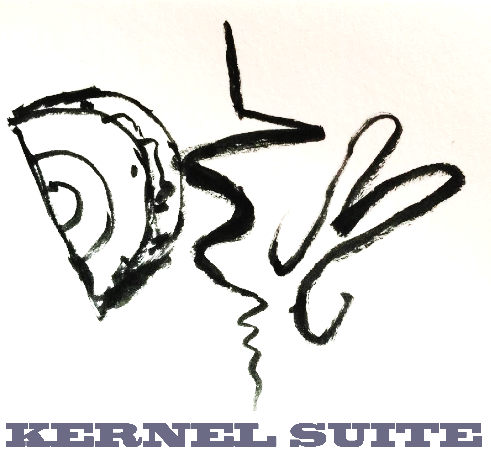
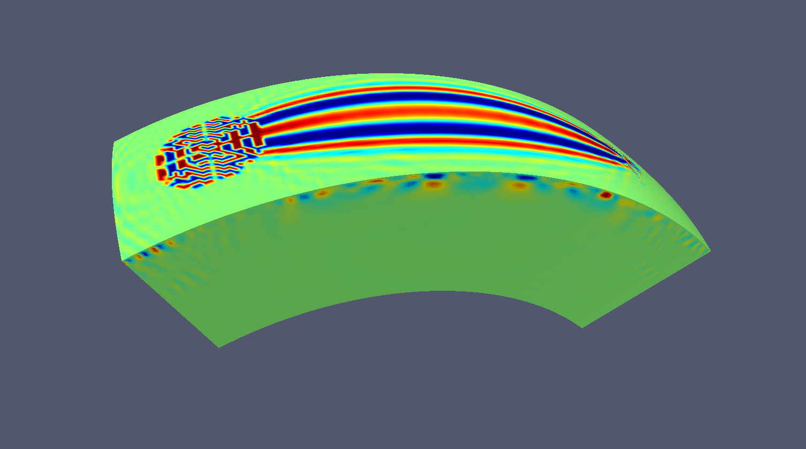

### Welcome to DSM Kernel Suite!
This suite of programmes is to calculate 3D finite frequency Fréchet sensitivity kernels (or 3D waveform partial derivatives) for 1D reference Earth models using Direct Solution Method. It consists of forward and back propagated strain Green's function calculation in a 2D plane, cross correlations of forward and back propagated wavefields to obtain sensitivity kernels. We developed also visualisation facilities of kernels. Those who would like to get kernels by comparing observed and synthetic waveforms, we developed python interface for that purpose as well. All the main motors are parallelised and you just have to submit prepared scripts. 

## Programmes inside DSM Kernel Suite
DSM Kernel Suite have five independent programmes for each step. If you fetch the application's source with git, this dependency will be fetched automatically. 
* SGTpsv : Green's function calculation for PSV mode (MPI fortran, NF) 
* SGTsh  : Green's function calculation for SH  mode (MPI fortran, NF)
* wave2kernel : visualisation of SAC files in order to compare them with synthetics and to decide which phase (python, HJ)
* KernelMaker : 3D Fréchet derivatives calculation (MPI fortran, NF)
* KernelViewer : 3D Kernel visualisation facilities (python, MM)

The programmes implicitly require several third-party dependencies:
* ifort
* obspy
* ParaView 

## Build and Install

* Make SGTpsv, SGTsh, KernelMaker by configuring etc/config_calcul/config.h (compiler options etc.) 
* Further information will be available in ...

## Examples
 * [single station and event](examples/example_1station_1event/README.md)
 * [multiple stations and events](examples/example_214km/README.md)

## Kernel Gallery

## Papers to be cited
Fuji, N., Chevrot, S., Zhao, L., Geller, R.J., Kawai, K. (2012) Partial derivatives of high-frequency compressional body waves for 3-D Earth structure, Geophys. J. Int., 190, 522-540.

### Authors and Contributors
All rights reserved, 2016, Nobuaki Fuji (@seismobassoon), Matthias Meschede (@MMesch), Kensuke Konishi (@kensuke1984), Hugo Jaegler (@hJaegler), Kenji Kawai, Li Zhao, Sébastien Chevrot, Robert J. Geller, Vadim Monteiller, Dimitri Komatitsch, Marie Calvet, Hiromitsu Mizutani

### Support or Contact
Having trouble with DSM Kernel Suit? Check out our [documentation](https://help.github.com/pages) or [contact support](email:nobuaki@ipgp.fr) and we’ll help you sort it out.
