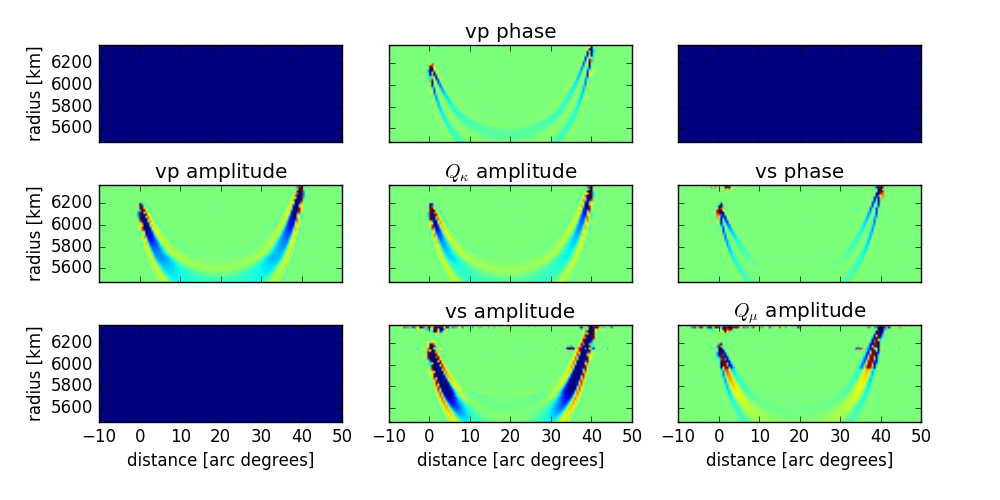

## single station and event example

### Overview
This example demonstrates the two central steps of this code:

1. the computation of a database of Green functions for a specified region of the Earth.
2. the computation of a kernel using the previously computed database

### Instructions
#### The Green function database
To compute the database you need the two programs SGTpsv and SGTsh. That
compute the databases necessary for PSV and SH waves, respectively. The sources
of these codes are stored in `DSM-Kernel/src/SGTpsv/` and `DSM-Kernel/src/SGTsh/`.

##### Compilation
1. adjust the Makefiles (e.g. `DSM-Kernel/src/SGTpsv/Makefile`). You should for
   example chose you fortran compiler, e.g. `FC=mpif90` or `FC=mpiifort`.
2. type: `make` in the SGTsh and in the SGTpsv directories.
3. check that there were no errors and if you can find the binaries:
   `DSM-Kernel/bin/mpiSGTpsv` and `DSM-Kernel/bin/mpiSGTsh`

##### Configuration and Execution
1. copy the file `database.inf.example` to `database.inf`. In this file:
 * adjust the paths (replace [xy] with the path of your DSM-Kernel installation)
 * adjust the output directory path [mydatabase], where the database is stored.
   The database needs some disk space. Make sure to have ~2-3 Gb free.
 * generate the following empty subdirectories in your database folder:
   `[mydatabase]/log`, `[mydatabase]/RSGT`and `[mydatabase]/TSGT`
 * you can adjust the remaining parameters that control e.g. frequency range,
   domain size and sampling of the database. In particular chose the source depth
   for which you want to compute the database!
2. submit the command `mpirun -tmi -np 256  ../../bin/mpiSGTpsv < ./database.inf`
   to compute the psv database. Select the number of processors that you want to use
   with the -np parameter (256 in this example). `run_database.slurm` shows an
   example script that submits this process to the IPGP cluster malbec.
3. check if there were any errors. The subfolders in [mydatabase] should
   be full of files (carful, typing `ls` will take some time)

#### Kernel Calculation
#### Compilation
2. type: `make` in the KernelMaker directory
3. check that there were no errors and that you can find the binaries:
   `DSM-Kernel/bin/mpiKernelMaker`.

#### Configuration and Execution
1. copy the file `kernel.inf.example` to `kernel.inf`. In this file:
 * adjust the directory `[xy]` to point to your DSM-Kernels installation
 * check out the other parameters that are used to control the source, filters
   and other parameters. The time window controls for which phase you compute
   the sensitivity kernel. The time window, source depth and source-station distance
   have to correspond or be within the ranges specified
   in the database configuration file (`database.inf`).
2. make sure that the output directory that you specified has an empty subdirectoy
   called `log`. (e.g. output/log/)
3. submit the command `mpirun -tmi -np 128 ../../bin/mpiKernelMaker < ./kernel.inf`
4. check if there were errors. If not, the output directory should contain
   files named: `eq.Explosion.Z.Z.5471000` up to `eq.Explosion.Z.Z.6371000` that
   contain a slice of the kernel at one particular depth.

#### Visualization
This program provides several visualisation tools. the basic visualisation
tools are useful to examine the datastructure of the output files and how
they can be read. Note that `python2.7` with `numpy` and `matplotlib` is required
to run these scripts. For more advanced plotting, you can convert the kernels
to vtk files to view and plot them e.g. with `paraview` or `mayaview`.

##### basic 2D plotting
1. check out and run the python script `simple_plot_synthetics.py`. It saves a
   plot of the synthetic seismogram in the selected time range in the file
   `synthetics.png`. You should be able to identify the phase here for which you
   wanted to compute the kernel (in this case the direct P wave). If appropriate
   database frequency ranges, sampling, and kernel filters have been selected in
   `database.inf` and `kernel.inf`, you should see clean arrivals. Otherwise you
   might see some ringing due to sharp frequency cutoffs, which is not a problem
   as long as you are aware of them.
   

   
   

2. check out and run the script `simple_plot_kernels.py`. The `kernel.png` image file
   should be generated in the example folder.
   It shows a vertical slice of the 3D kernel along the greatcircle connecting source
   and receiver. The different axes within the plot show the different kernel types
   that were computed.
   

   
   

##### basic 3D plotting
1. check out and run the python script `simple_write_vtk.py`. You need the
   python module `pyevtk` for this (e.g. `pip install pyevtk`). The script saves a
   file `kernel.vts` in the example directory that can be opened and visualized
   with paraview.
   

   
   

